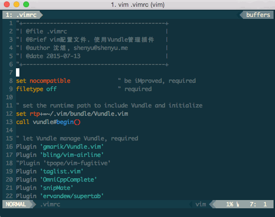
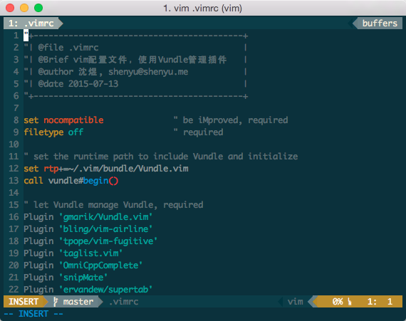
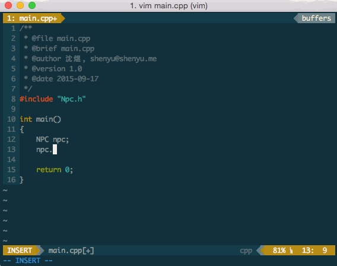
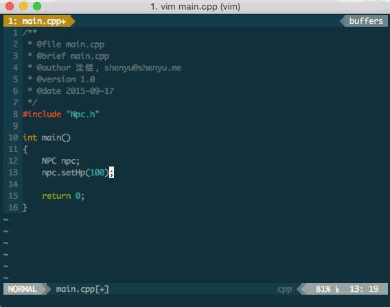
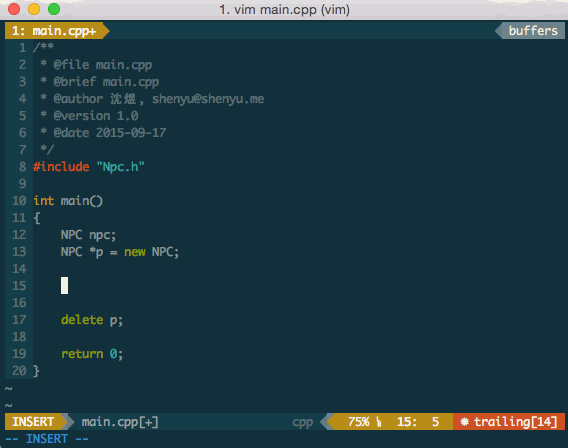
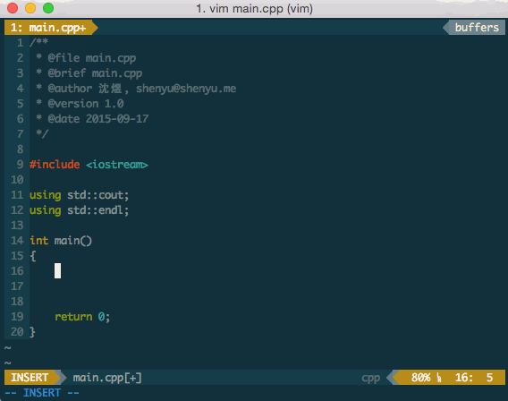
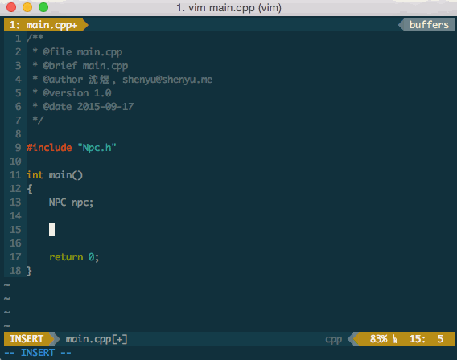
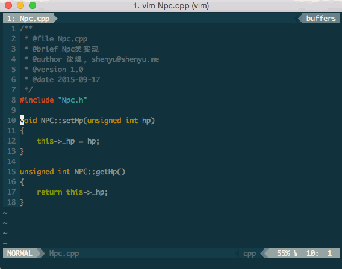

# Vim-Configuration

我的 Vim 配置，使用 Vundle 管理插件。


## 一键配置部署

```shell
sh -c "$(curl -fsSL https://raw.githubusercontent.com/chrisniael/vim-configuration/master/install.sh)"
```


## <a id="install-ctags">安装 *ctags*</a>

部分 vim 插件基于 ctags （Mac OS 自带的 ctags 并非 vim 插件需要的 ctags）。

* `curl -L http://prdownloads.sourceforge.net/ctags/ctags-5.8.tar.gz -o ctags-5.8.tar.gz` 下载 [ctags-5.8](http://ctags.sourceforge.net/) 源码

* `tar -zxvf ctags-5.8.tar.gz` 解压文件

* `cd ctags` 进入 *ctags-5.8* 源码目录

* `make` 编译

* 编译成功以后，执行 `sudo make install` 进行安装


## 插件清单

* ### <a id="vundle">Vundle</a>

    vim 插件管理器。

* ### <a id="vim-airline">vim-airline</a>

    逼格相当高的状态栏插件
    
    

* ### <a id="vim-fugitive">vim-fugitive</a>

    Git 插件，直接在 Vim 中执行 Git 命令。
    
    
    
* ### <a id="vim-colors-solarized">vim-colors-solarized</a>

    solarized 主题。

* ### <a id="a">A</a>

    快速跳转 .h 和 .cpp 文件。
    
    

    #### 功能

    * 输入命令 `:A` 会跳转到对应的 .h 或 .cpp 文件

    * 输入命令 `:AV` 会垂直切割出新的窗口来打开对应的 .h 或 .cpp 文件

    * 输入命令 `:AS` 会水平切割出新的窗口来打开对应的 .h 或 .cpp 文件

* ### <a id="doxygen">Doxygen Toolkit</a>

    快速插入 Doxygen 注释。
    
    

    #### 功能

    * 输入 `:Dox` 会在函数或类的定义的上一行插入 Doxygen 注释

    * 插入 `:DoxAuthor` 会在光标位置出插入 `文件名`，`作者`，`时间`等信息。
        
* ### <a id="echofunc">Echofunc</a>

    快速查看函数原型，基于 [ctags](#install-ctags)。
    
    

* ### <a>NERD Commenter</a>

    代码注释插件，可以快速注释和取消注释代码。
    
    

    #### 功能

    * `\` `c` `c` ：注释当前行或已选的代码块。
    * `\` `c` `c` ：与上面功能相反，取消注释。
    * `\` `c` `m` ：使用多行注释样式 `/* */` 注释。
	* `<number>` `\` `c` `c` ：注释<number>行

* ### <a id="omnicpp">OmniCppComplete</a>

    快速补全C++代码，基于 [ctags](#install-ctags)。
    
    

    #### 功能

    * 输入 `.` 后自动补全成员函数/成员变量名

    * 输入 `->` 后自动补全成员函数/成员变量名

    * 输入 `::` 后自动补全类成员

    * `Ctrl` + `X` 随后 `Ctrl` + `X` 随后 `Ctrl` + `N` ：自动补全代码

    * `Ctrl` + `X` 随后 `Ctrl` + `X` 随后 `Ctrl` + `P` ：自动补全代码（反序选择）

    * `Ctrl` + `N` ：选择补全列表中的下一项或使用局部关键字补全代码

    * `Ctrl` + `P` ：选择补全列表中的上一项或使用局部关键字补全代码

* ### <a id="snipmate">SnipMate</a>

    代码补全插件，基于 [ctags](#install-ctags)。
    
    

    #### 功能

    * 输入 `for` 然后按 `Tab` 会自动插入下面这些代码

    ```cpp
    for (i = 0; i < count; i++) {
        /* code */
    }
    ```

    然后再按 `Tab` 键，光标会依次跳转到模板代码中各个可编辑的值部分，以便修改成你想要的代码。

    可以自己新建或编辑对应的模板代码，以适应自己的编码风格，模板代码存放于 `~/.vim/snipmat/` 中。


* ### <a id="supertab">SuperTab</a>

    使用 `Tab` 键补全代码，基于 [ctags](#install-ctags)。
    
    

    #### 功能

    * 输入部分关键字后按 `Tab` 会搜索局部作用域中的关键字去补全代码

    * 按 `Tab` 键会选择下一个补全列表中的选项


* ### <a id="taglist">TagList</a>

    代码结构化视图，基于 [ctags](#install-ctags)。
    
    

    #### 功能

    * 输入 `:TlistToggle` 打开 Taglist。

    * 将光标移动到某个 tag 上，然后按 `空格` 键，在命令栏中会显示该tag在源码中完整的写法。

    * 将光标移动到某个tag 上，然后按 `回车` 键，会跳转到相应文件的定义出。


* ### <a id="vim-markdown">vim-markdown</a>

    markdown 语法高亮


## 自定义快捷键

* ### `Ctrl` + `A`

    相当于执行 `:A`（[A 插件](#a) 的功能键），跳转到当前文件对应的 .h  或 .cpp 文件中，如果不存在则会询问是否建立。

* ### `Ctrl` + `A` 紧接着 `Ctrl` + `V`

    相当于执行 `:AV`，功能同上，但会再垂直切割出新的窗口来打开对应文件。

* ### `tt`

	打开 [TagList 插件](#taglist)，相当于执行 `:TlistToggle`。

* ### `Tab`

	[SuperTab](#supertab) 和 [snipMate](#snipmate) 插件的功能键，可以补全关键字和快速插入预定义的语法格式。
